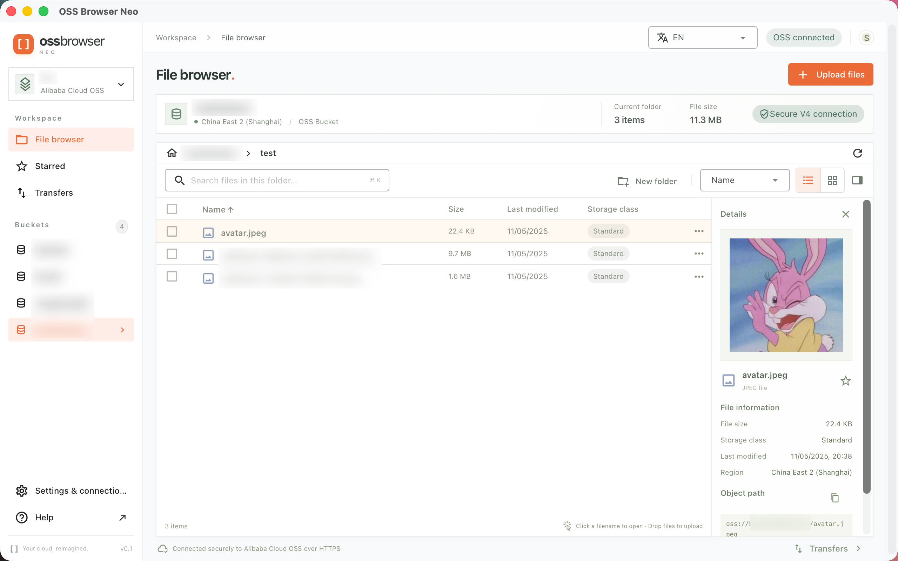

# OSS Browser Neo

A modern Alibaba Cloud OSS browser.

一个现代的阿里云OSS浏览器。



## Why this project?

Alibaba provides an [official OSS Browser](https://github.com/aliyun/oss-browser), but the project has not received a new release for several years.

In particular, the macOS version of the original OSS Browser was built primarily for Intel-based Macs and does not provide a modern native experience for Apple Silicon devices.

## Build from source

This project uses Tauri, which theoretically supports all operating systems, but it has only been tested on macOS.

```shell
pnpm i
pnpm tauri build
```

This .dmg file is located in:

```
src-tauri/target/release/bundle/dmg/
```

## AI Usage

This project is an AI slogan. I could not have produced it without Codex.

## Disclaimer

This software is provided as an open-source project under Apache License 2.0. It is not affiliated with Alibaba or Alibaba Cloud.

For detailed information about using Alibaba Cloud OSS, please refer to the official documentation. ([zh](https://help.aliyun.com/zh/oss/), [en](https://help.aliyun.com/en/oss/))